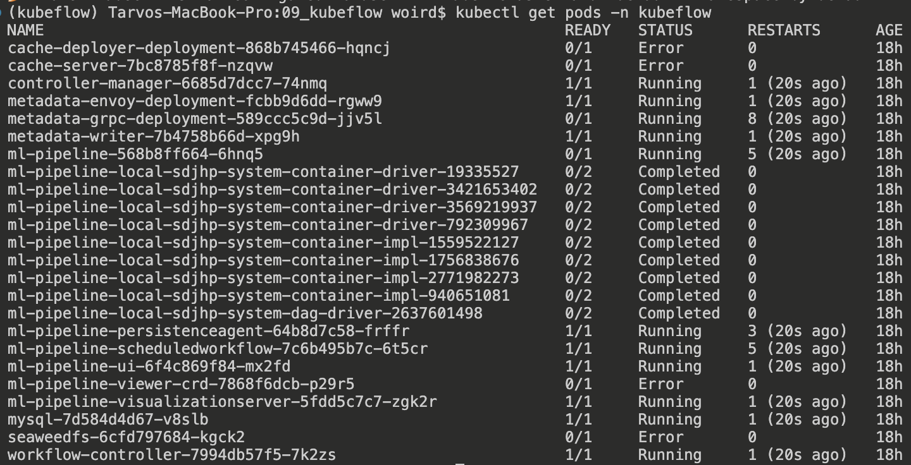
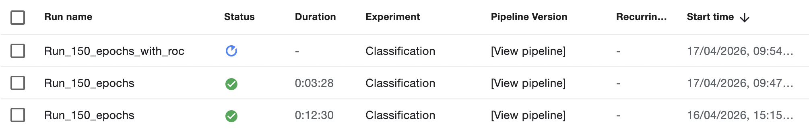
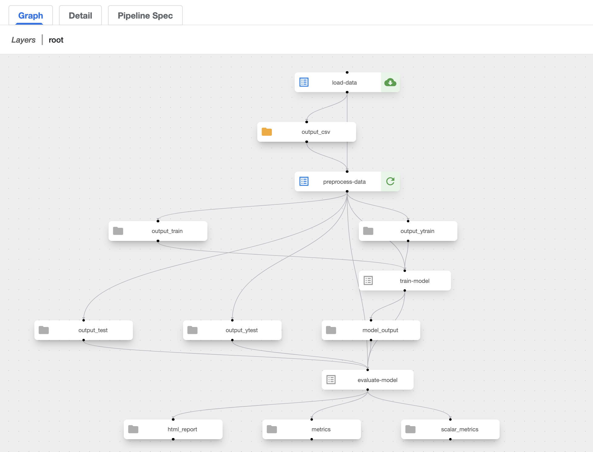
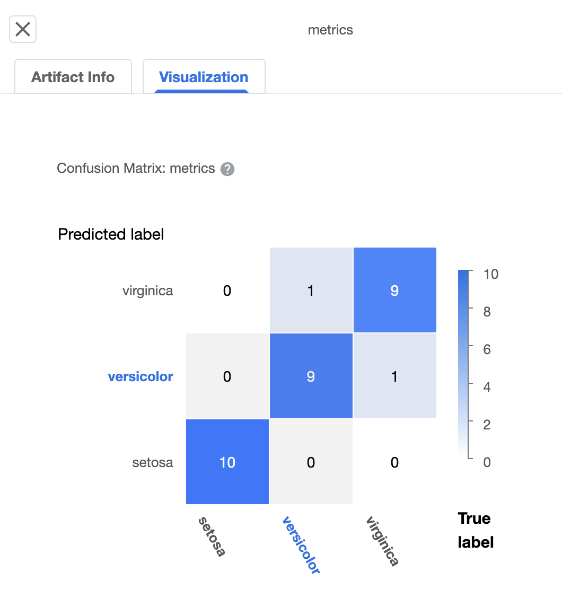
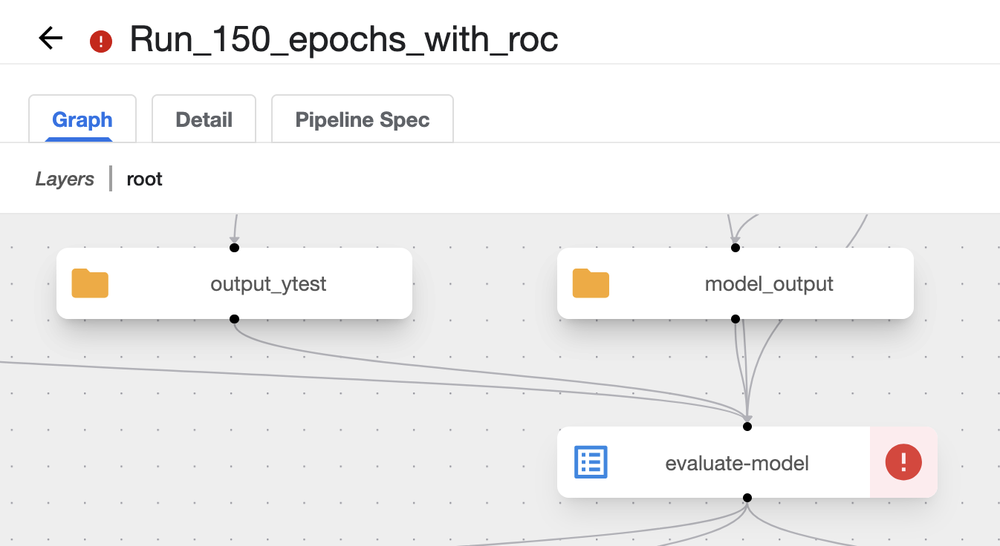

# MLOps Kubeflow Practice Report – Pipelines on Minikube
**MLOps Fundamentals - LTAT.02.038**

---

## Overview

In this practice, I set up a local Kubeflow Pipelines environment using Minikube and executed a simple machine learning pipeline based on the Iris dataset.

The goal was to:
- understand Kubeflow Pipelines
- run ML workflows on Kubernetes
- generate and visualize model evaluation metrics
- debug failures in pipeline components

The pipeline includes:
- data loading
- preprocessing
- model training
- evaluation

---

## Steps Performed

### 1. Minikube Setup

Started a local Kubernetes cluster (reduced the memory limit due to OOM issues):

```bash
minikube start --cpus 4 --memory 6144 --disk-size=40g --driver=docker
```

Installed Kubeflow Pipelines:

```bash
export PIPELINE_VERSION=2.16.0
kubectl apply -k "github.com/kubeflow/pipelines/manifests/kustomize/cluster-scoped-resources?ref=$PIPELINE_VERSION"
kubectl wait --for condition=established --timeout=60s crd/applications.app.k8s.io
kubectl apply -k "github.com/kubeflow/pipelines/manifests/kustomize/env/dev?ref=$PIPELINE_VERSION"
```

Checked pods:

```bash
kubectl get pods -n kubeflow
```



---

### 2. Fixing Deployment Issues

Some pods entered `Error` state. One workaround used during setup was patching the `metadata-writer` image:

```bash
kubectl patch deployment metadata-writer -n kubeflow --patch '{"spec": {"template": {"spec": {"containers": [{"name": "main", "image": "gcr.io/ml-pipeline/metadata-writer:2.0.5"}]}}}}'
kubectl delete pods -n kubeflow -l app=metadata-writer
```

In Kubeflow Pipelines, `metadata-writer` helps write run metadata and artifact-related information so the UI and backend can understand pipeline outputs properly. The patching replaced the container image used by the `metadata-writer` deployment.

---

### 3. Accessing Kubeflow UI

```bash
kubectl port-forward -n kubeflow svc/ml-pipeline-ui 8080:80
```

Opened in browser:

```text
http://localhost:8080
```

---

### 4. Pipeline Implementation

Created a Kubeflow pipeline with components defined by the provided Python script:
- `load_data`
- `preprocess_data`
- `train_model`
- `evaluate_model`

The model used was a scikit-learn Logistic Regression classifier trained on the Iris dataset (30 test images).

---

### 5. Running the Pipeline

Executed the Python pipeline script locally using uv (optional bonus learning objective):

```bash
uv run python pipeline.py
```

This compiled the pipeline to YAML and submitted a new run to Kubeflow.

---

### 6. Pipeline Execution in Kubeflow UI

Observed the run in the Kubeflow UI.

#### Runs table


#### Pipeline DAG


---

### 7. Model Evaluation

The evaluation step produced:
- scalar metrics such as accuracy
- a confusion matrix in the Kubeflow UI (needed some code additions)
- optional: an HTML report artifact after some updates

#### Confusion Matrix


---

## Error Encountered During ROC Version

When I extended the evaluation step to log ROC data, the pipeline run failed in the `evaluate-model` component.

#### Error screenshot


#### Error message
```text
failed to unmarshall ExecutorOutput ... invalid value Infinity
```

### What caused it

The issue came from the ROC thresholds generated by `sklearn.metrics.roc_curve`. In newer scikit-learn versions, the first threshold is `np.inf`, which is valid in Python but not valid in the JSON/protobuf-style metadata written by Kubeflow.

As a result, the component finished Python execution but Kubeflow failed when parsing `output_metadata.json`.

### Practical fix

Before logging ROC values to Kubeflow, remove non-finite values such as `Infinity` from:
- `thresholds`
- `fpr`
- `tpr`

A simple solution is to filter with `numpy.isfinite(...)` before calling `metrics.log_roc_curve(...)`.

---

## Learnings and Understanding

### Kubeflow vs Kubernetes

- **Kubernetes** is a general container orchestration platform.
- **Kubeflow** runs on top of Kubernetes and adds ML-specific tooling.

Kubernetes manages:
- pods
- deployments
- services
- storage
- networking

Kubeflow adds:
- ML pipelines
- experiment runs
- artifact tracking
- UI for ML workflow execution

In short:
- **Kubernetes = infrastructure layer**
- **Kubeflow = machine learning workflow layer on top of Kubernetes**

---

### Kubeflow vs MLflow

- **MLflow** focuses on experiment tracking, model logging, and model registry.
- **Kubeflow Pipelines** focuses on orchestrating multi-step ML workflows.

MLflow is mainly about:
- recording metrics
- saving models
- comparing runs

Kubeflow is mainly about:
- defining pipeline steps
- executing them as containers
- managing dependencies between steps

In short:
- **MLflow tracks experiments**
- **Kubeflow runs pipelines**

They can be used together, but they solve different problems.

---

### Key Observations

- Each Kubeflow pipeline step runs as its own Kubernetes workload.
- Debugging often means checking pod status and logs, not only Python code.
- Local Minikube environments are useful for learning, but they are more fragile than managed clusters.
- Visualization artifacts can fail not only because of model logic, but also because of metadata formatting issues.

---

## Challenges

| Issue                               | Solution                                               |
| ----------------------------------- | ------------------------------------------------------ |
| Some Kubeflow pods in `Error` state | Patched or restarted specific components               |
| Missing UI visualizations           | Added explicit artifacts and debugging outputs         |
| ROC pipeline run failed             | Filtered out non-finite ROC thresholds before logging  |
| Resource limits in local cluster    | Reused cluster where possible and monitored pod health |

---

## Conclusion

I successfully:
- deployed Kubeflow Pipelines locally on Minikube
- ran an ML pipeline on Kubernetes
- generated evaluation metrics in the Kubeflow UI
- debugged a real pipeline artifact failure related to ROC logging

This exercise helped me understand that Kubeflow is not just about training models, but about packaging ML workflows into reproducible, debuggable pipeline steps running on Kubernetes.

It also highlighted that ML tooling differences matter:
- Kubernetes manages infrastructure
- Kubeflow manages ML workflows
- MLflow manages experiment tracking